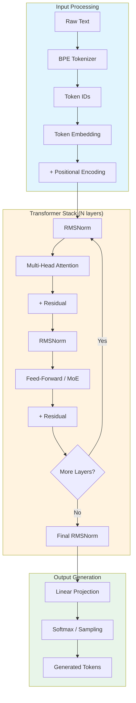
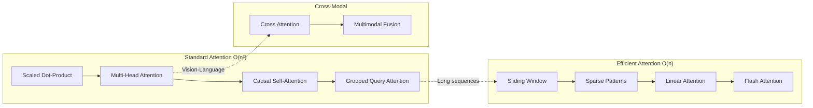
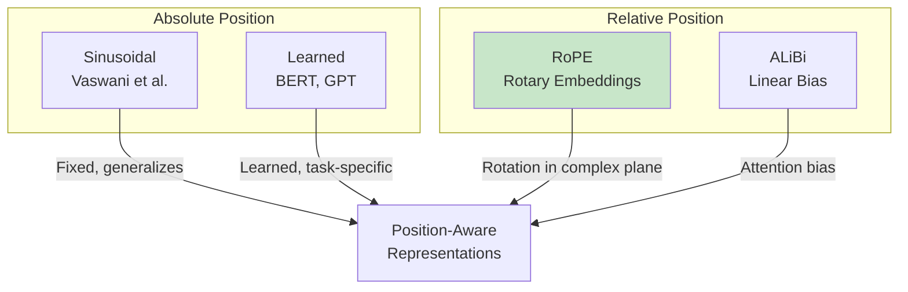
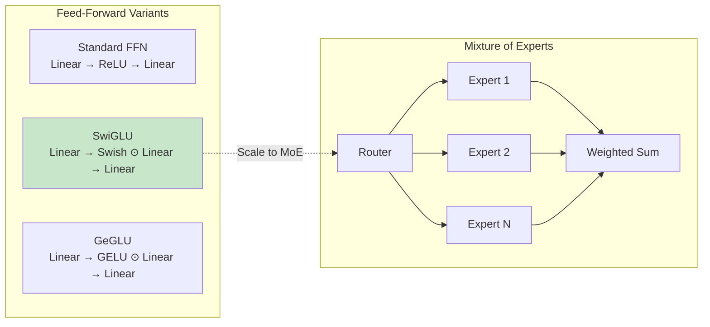
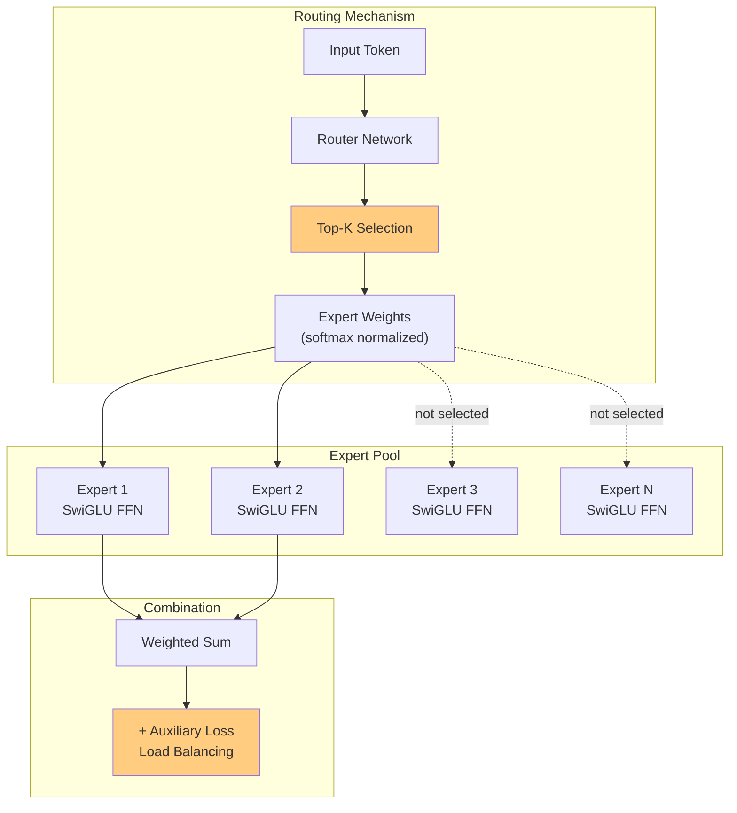
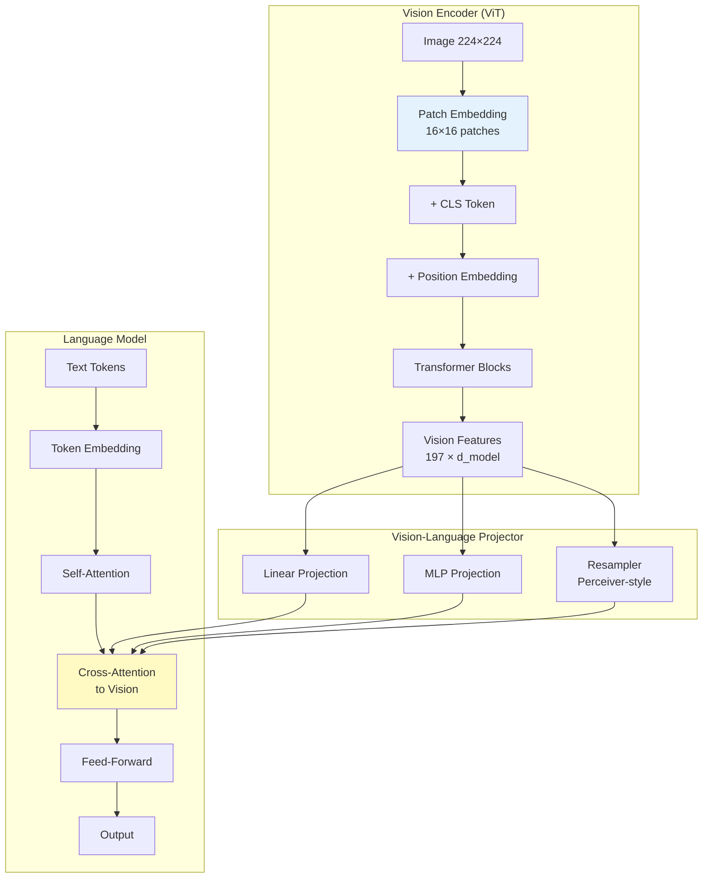
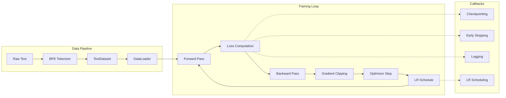
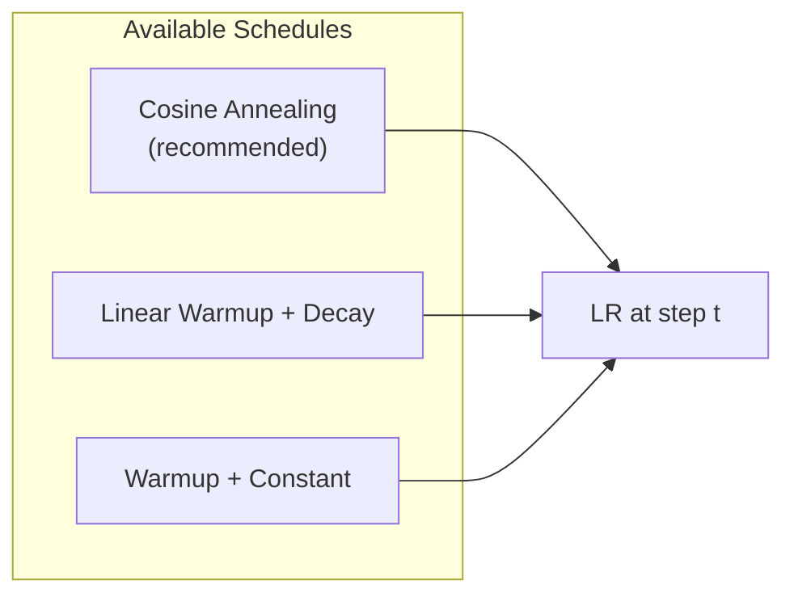
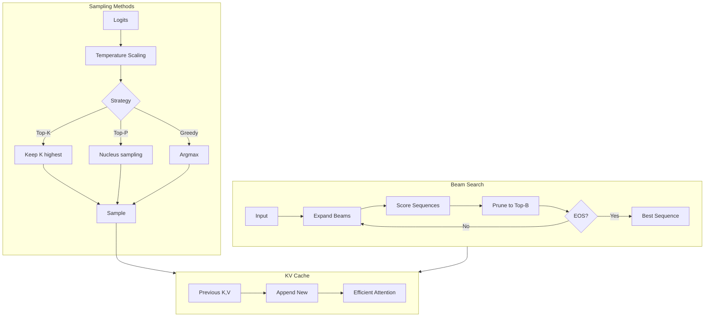

# Gemini-Q: Transformer Architecture from First Principles

<div align="center">

**A research-grade implementation of modern transformer architectures built entirely from scratch**

[](https://www.python.org/downloads/)
[](https://pytorch.org/)
[]()
[](https://opensource.org/licenses/MIT)

</div>

---

## Philosophy

This project takes an **opinionated, research-first approach** to understanding transformer architectures. Rather than wrapping existing libraries, we implement every component from mathematical foundations—scaled dot-product attention, rotary embeddings, SwiGLU activations, mixture of experts, and multimodal fusion—to build intuition that transfers to reading papers and production codebases.

> *"What I cannot create, I do not understand."* — Richard Feynman

---

## Architecture Overview



---

## Core Components

### Attention Mechanisms

We implement the full spectrum of attention variants, from foundational to state-of-the-art:



| Component | Complexity | Use Case |
|-----------|------------|----------|
| `MultiHeadAttention` | O(n²d) | Standard transformer attention |
| `CausalSelfAttention` | O(n²d) | Autoregressive language modeling |
| `GroupedQueryAttention` | O(n²d/g) | Reduced KV cache (Llama 2, Mistral) |
| `SlidingWindowAttention` | O(nwd) | Long sequences (Longformer, Mistral) |
| `LinearAttention` | O(nd²) | Very long sequences, linear complexity |
| `FlashAttentionSimulator` | O(n²d) | Memory-efficient tiled computation |

### Positional Encodings



**Our default: Rotary Position Embeddings (RoPE)** — Encodes position through rotation in the complex plane, enabling length extrapolation and efficient computation.

### Feed-Forward Networks



**Our default: SwiGLU** — Gated linear units with Swish activation, shown to improve training stability and final performance (PaLM, LLaMA).

### Mixture of Experts (MoE)



| Component | Description |
|-----------|-------------|
| `Router` | Learned gating with top-k selection and optional noise |
| `Expert` | Individual SwiGLU or standard FFN |
| `MoELayer` | Full routing with load balancing auxiliary loss |
| `SparseMoE` | Capacity-based routing with token dropping |

---

## Multimodal Architecture

Vision-language modeling through patch embeddings and cross-modal attention:



### Fusion Strategies

| Strategy | Description | Use Case |
|----------|-------------|----------|
| `cross_attention` | Bidirectional attention between modalities | Rich interaction |
| `gated` | Learned gating for selective fusion | Controlled mixing |
| `concat` | Simple concatenation | Early fusion |

---

## Training Pipeline



### Optimizer Configuration

**AdamW** with decoupled weight decay, following modern practices:

```python
# Weight decay applied to 2D parameters only (not biases, not LayerNorm)
configure_optimizer(
    model,
    learning_rate=3e-4,
    weight_decay=0.1,
    betas=(0.9, 0.95),  # β₂ = 0.95 for stability
)
```

### Learning Rate Schedules



---

## Generation Strategies



| Strategy | Parameters | Use Case |
|----------|------------|----------|
| Greedy | — | Deterministic, fast |
| Temperature | `τ ∈ (0, 2]` | Control randomness |
| Top-K | `k ∈ [1, vocab]` | Limit token pool |
| Top-P (Nucleus) | `p ∈ (0, 1]` | Dynamic pool size |
| Beam Search | `beams, length_penalty` | Best sequence search |

---

## Project Structure

```
geminiq/
├── src/
│   ├── models/
│   │   ├── attention.py          # Multi-head, causal, GQA
│   │   ├── embeddings.py         # Token, sinusoidal, RoPE
│   │   ├── feedforward.py        # FFN, SwiGLU, GeGLU
│   │   ├── transformer_block.py  # Pre-LN blocks, RMSNorm
│   │   ├── transformer.py        # Complete model
│   │   ├── efficient_attention.py # Sliding window, sparse, linear
│   │   ├── moe.py                # Mixture of Experts
│   │   └── multimodal.py         # Vision encoder, cross-modal
│   │
│   ├── training/
│   │   ├── optimizer.py          # AdamW, LR schedules
│   │   ├── losses.py             # Cross-entropy, focal loss
│   │   ├── callbacks.py          # Training callbacks
│   │   └── trainer.py            # Training loop
│   │
│   ├── generation/
│   │   ├── sampling.py           # Temperature, top-k, top-p
│   │   ├── beam_search.py        # Beam search decoding
│   │   └── cache.py              # KV cache for inference
│   │
│   ├── data/
│   │   ├── tokenizer.py          # BPE tokenizer (SentencePiece)
│   │   ├── dataset.py            # PyTorch datasets
│   │   └── dataloader.py         # Batching and collation
│   │
│   └── utils/
│       ├── device.py             # CPU/CUDA/MPS detection
│       ├── config.py             # YAML configuration
│       ├── checkpointing.py      # Model save/load
│       ├── metrics.py            # Perplexity, accuracy
│       └── visualization.py      # Attention plots
│
├── configs/
│   ├── small_model.yaml          # 25M params, runs on CPU
│   ├── medium_model.yaml         # 125M params, single GPU
│   └── large_model.yaml          # 350M params, reference
│
├── scripts/
│   ├── train.py                  # Training entry point
│   ├── generate.py               # Text generation
│   ├── chat.py                   # Interactive chat
│   └── verify_setup.py           # Installation check
│
└── tests/                        # 146 unit tests
    ├── test_models.py
    ├── test_advanced.py
    ├── test_data.py
    └── test_utils.py
```

---

## Quick Start

### Installation

```bash
# Clone the repository
git clone https://github.com/yourusername/geminiq.git
cd geminiq

# Create environment (choose one)
conda env create -f environment.yml && conda activate gemini-workshop
# OR
pip install -e .

# Verify installation
python scripts/verify_setup.py
```

### Training

```bash
# Train a small model (CPU-friendly)
python scripts/train.py --config configs/small_model.yaml

# Train with custom settings
python scripts/train.py \
    --config configs/medium_model.yaml \
    --batch_size 16 \
    --learning_rate 1e-4 \
    --max_steps 50000
```

### Generation

```bash
# Generate text
python scripts/generate.py \
    --checkpoint checkpoints/model.pt \
    --prompt "The transformer architecture" \
    --max_tokens 100 \
    --temperature 0.8 \
    --top_p 0.9

# Beam search
python scripts/generate.py \
    --checkpoint checkpoints/model.pt \
    --prompt "In the beginning" \
    --beam_search \
    --num_beams 4
```

### Interactive Chat

```bash
python scripts/chat.py --checkpoint checkpoints/model.pt
```

---

## Configuration

Model configurations follow a hierarchical YAML structure:

```yaml
model:
  vocab_size: 32000
  d_model: 768
  n_heads: 12
  n_layers: 12
  d_ff: 3072                    # 4 * d_model
  max_seq_len: 2048
  dropout: 0.1

  # Architecture choices
  norm_type: "rmsnorm"          # rmsnorm | layernorm
  ffn_type: "swiglu"            # swiglu | geglu | standard
  pos_encoding: "rope"          # rope | sinusoidal | learned
  attention_type: "standard"    # standard | gqa | sliding_window

  # GQA settings (if attention_type: gqa)
  n_kv_heads: 4                 # Number of KV heads

  # MoE settings (optional)
  use_moe: false
  num_experts: 8
  top_k: 2

training:
  batch_size: 32
  gradient_accumulation: 4
  learning_rate: 3e-4
  weight_decay: 0.1
  warmup_steps: 1000
  max_steps: 100000
  gradient_clip: 1.0

  # Mixed precision
  use_amp: true

  # Checkpointing
  save_every: 1000
  eval_every: 500

data:
  train_path: "data/train.txt"
  val_path: "data/val.txt"
  seq_length: 512
  tokenizer_path: "tokenizers/bpe_32k.model"
```

---

## Design Decisions

### Why Pre-LN over Post-LN?

```
Post-LN: x → Attention → Add → LayerNorm → FFN → Add → LayerNorm
Pre-LN:  x → LayerNorm → Attention → Add → LayerNorm → FFN → Add
```

Pre-LN provides more stable gradients at initialization, enabling training of deeper models without careful learning rate tuning. Used in GPT-2, LLaMA, and most modern architectures.

### Why RMSNorm over LayerNorm?

RMSNorm computes only the root mean square, skipping mean centering:

```
LayerNorm: (x - μ) / σ * γ + β
RMSNorm:   x / RMS(x) * γ
```

~15% faster with equivalent performance. Used in LLaMA, Mistral, Gemma.

### Why SwiGLU over GELU?

Gated Linear Units with Swish activation:

```
SwiGLU(x) = Swish(xW₁) ⊙ (xW₂)
```

Empirically outperforms standard FFN and GELU variants at equivalent parameter counts. Used in PaLM, LLaMA, Gemini.

### Why Rotary Position Embeddings?

RoPE encodes position through rotation in complex plane:

```
RoPE(x, pos) = x ⊙ cos(pos·θ) + rotate(x) ⊙ sin(pos·θ)
```

Benefits:
- Decaying influence with distance (inductive bias)
- Efficient computation
- Length extrapolation capabilities

---

## Testing

```bash
# Run all tests
pytest tests/ -v

# Run specific test modules
pytest tests/test_models.py -v
pytest tests/test_advanced.py -v

# Run with coverage
pytest tests/ --cov=src --cov-report=html
```

**Test Coverage:** 146 tests across all components.

---

## References

### Papers

- [Attention Is All You Need](https://arxiv.org/abs/1706.03762) (Vaswani et al., 2017)
- [RoFormer: Enhanced Transformer with Rotary Position Embedding](https://arxiv.org/abs/2104.09864) (Su et al., 2021)
- [GLU Variants Improve Transformer](https://arxiv.org/abs/2002.05202) (Shazeer, 2020)
- [Root Mean Square Layer Normalization](https://arxiv.org/abs/1910.07467) (Zhang & Sennrich, 2019)
- [Switch Transformers: Scaling to Trillion Parameter Models](https://arxiv.org/abs/2101.03961) (Fedus et al., 2021)
- [FlashAttention: Fast and Memory-Efficient Exact Attention](https://arxiv.org/abs/2205.14135) (Dao et al., 2022)
- [LLaMA: Open and Efficient Foundation Language Models](https://arxiv.org/abs/2302.13971) (Touvron et al., 2023)

### Architectures Implemented

| Architecture | Components Used |
|--------------|-----------------|
| GPT-2 | Causal attention, learned position embeddings |
| LLaMA | RoPE, RMSNorm, SwiGLU, GQA |
| Mistral | Sliding window attention, GQA |
| Mixtral | MoE with top-2 routing |
| ViT | Patch embedding, CLS token |
| LLaVA | Vision projector, cross-modal attention |

---

## License

MIT License — See [LICENSE](LICENSE) for details.

---

<div align="center">

**Built with curiosity and PyTorch**

*Understanding transformers by building them from scratch*

</div>
